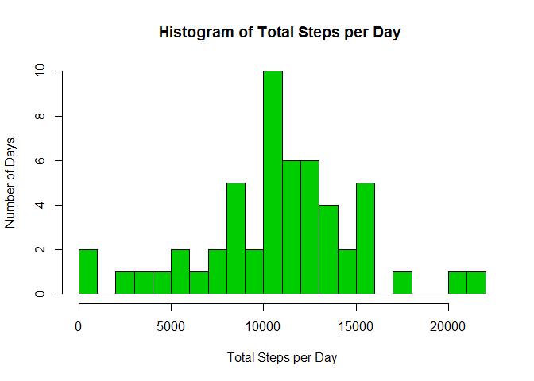
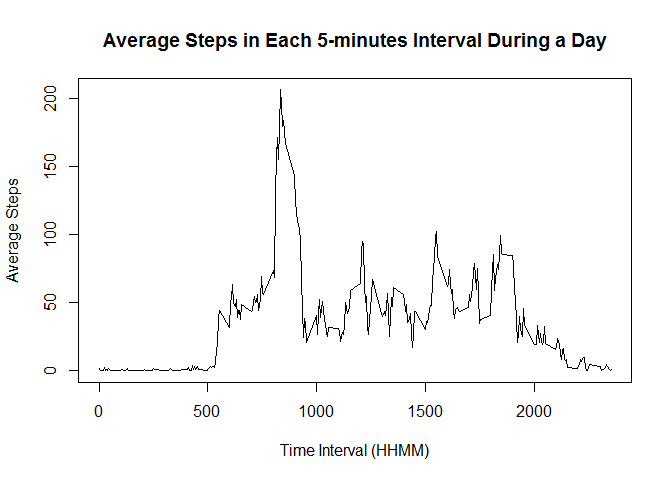
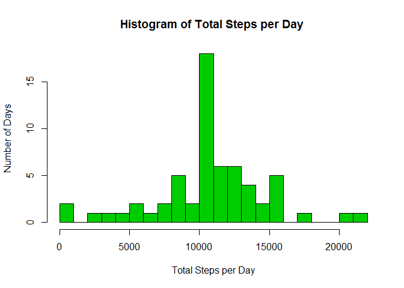
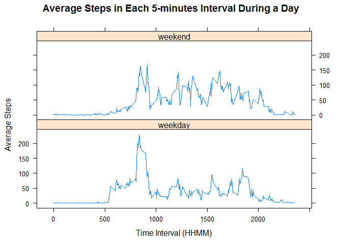

# **PA1_template**
laicheeonn  
19 September 2015  
  
  
This is my submission for the assignment 1 of Coursera's course, "Reproducible Research" by John Hopkin University.  

The dataset provided was taken from a personal activity monitoring device. This device collected data at 5 minute intervals through out the day. The data consists of two months of data from an anonymous individual collected during the months of October and November, 2012 and includes the number of steps taken in 5 minute intervals each day.  

The dataset was downloaded from the [course site](https://d396qusza40orc.cloudfront.net/repdata%2Fdata%2Factivity.zip).  
  
  
## **Loading and preprocessing the data**

From the following result, we can see that the dataset consists of 17,568 observations of 3 varibles, ie "step", "date" and "interval". The "interval" refers to the 5-minutes interval during the day which the corresponding "step" count was taken. The "date" of observations were for 61 days from 2012-10-01.  

There are 2304 of NA observations in "step". The "interval" varible was coerced to factor for later manipulation.  


```r
# Read in, examine and transform the data.

activityData <- read.csv("activity.csv",header = TRUE)
str(activityData)
```

```
## 'data.frame':	17568 obs. of  3 variables:
##  $ steps   : int  NA NA NA NA NA NA NA NA NA NA ...
##  $ date    : Factor w/ 61 levels "2012-10-01","2012-10-02",..: 1 1 1 1 1 1 1 1 1 1 ...
##  $ interval: int  0 5 10 15 20 25 30 35 40 45 ...
```

```r
summary(activityData)
```

```
##      steps                date          interval     
##  Min.   :  0.00   2012-10-01:  288   Min.   :   0.0  
##  1st Qu.:  0.00   2012-10-02:  288   1st Qu.: 588.8  
##  Median :  0.00   2012-10-03:  288   Median :1177.5  
##  Mean   : 37.38   2012-10-04:  288   Mean   :1177.5  
##  3rd Qu.: 12.00   2012-10-05:  288   3rd Qu.:1766.2  
##  Max.   :806.00   2012-10-06:  288   Max.   :2355.0  
##  NA's   :2304     (Other)   :15840
```

```r
activityData$interval <- as.factor(activityData$interval)
```
  
  
## **What is mean total number of steps taken per day?**  


```r
# Create a table for the total steps taken each day.

byDate <- data.frame(sapply(split(activityData, activityData$date, drop = TRUE),
                            function(x){sum(x$steps)}))
byDate <- cbind(as.POSIXct(rownames(byDate)), byDate)
colnames(byDate) <- c("date","total_steps")


# Plot a histogram for the total steps taken each day.

hist(byDate$total_steps, breaks = 22, col = 3,
     main = "Histogram of Total Steps per Day ", ylab = "Number of Days",
     xlab = "Total Steps per Day")
```

 

```r
# Calculate the mean and median for the total steps taken each day. 

print(meanSteps <- round(mean(byDate$total_steps, na.rm = TRUE)))
```

```
## [1] 10766
```

```r
print(medianSteps <- round(median(byDate$total_steps, na.rm = TRUE)))
```

```
## [1] 10765
```

The mean total number of steps taken per day is 10766, while the median is 10765. The mean and median are about the same.  
  
  
## **What is the average daily activity pattern?**
  

```r
# Create a table for the average steps taken each interval.

byInterval <- data.frame(sapply(split(activityData, activityData$interval, 
                        drop = TRUE), function(x){mean(x$steps, na.rm = TRUE)}))
byInterval <- cbind(as.numeric(rownames(byInterval)), byInterval)
colnames(byInterval) <- c("interval","average_steps")
intervalOrder <- order(byInterval$interval)
byInterval <- byInterval[intervalOrder,]


# Create a time series for the average steps taken each interval. 

plot(byInterval$interval, byInterval$average_steps, type = "l", 
     main = "Average Steps in Each 5-minutes Interval During a Day",
     xlab = "Time Interval (HHMM)", ylab = "Average Steps")
```

 

```r
maxStep <- max(byInterval$average_steps)
maxStepTime <- byInterval$interval[byInterval$average_steps == maxStep]
print(maxStepTime)
```

```
## [1] 835
```

For the plot, we can see that the subjects started waking up around 530am. The morning activities peak at 835, which is also the global maximum. The are also local peak at around 12pm, 330pm and 7pm, which corresponds to subsequent meal hours.  
  
  
## **Imputing missing values**

As mentioned earlier, there are 2304 missing values in "steps". I imputed these values with the corresponding 5-minutes interval average, and rerun the total steps per day analysis.  


```r
# Impute the missing values and create a new dataset.

activityData2 <- activityData
indexNA <- is.na(activityData2$steps)
totalNA <- sum(indexNA)
intervalNA <-as.integer(as.character(activityData2$interval[indexNA]))
stepsNA <- vector("numeric", totalNA)
for (j in seq_len(totalNA)){
    for (i in seq_len(nrow(byInterval))){
        if(byInterval$interval[i] == intervalNA[j]){
            stepsNA[j] <- byInterval$average_steps[i]
        }
    }
}
activityData2$steps[indexNA] <- stepsNA


# Create a table for the total steps taken each day. 
# (Dataset with imputed missing values.)

byDate2 <- data.frame(sapply(split(activityData2, activityData2$date, 
                                drop = TRUE), function(x){sum(x$steps)}))
byDate2 <- cbind(as.POSIXct(rownames(byDate2)), byDate2)
colnames(byDate2) <- c("date","total_steps")


# Plot a histogram for the total steps taken each day. 
# (Dataset with imputed missing values.)

hist(byDate2$total_steps, breaks = 22, col = 3,
     main = "Histogram of Total Steps per Day ", ylab = "Number of Days",
     xlab = "Total Steps per Day")
```

 

```r
# Calculate the mean and median for the total steps taken each day.
# (Dataset with imputed missing values.)

meanSteps2 <- round(mean(byDate2$total_steps, na.rm = TRUE))
medianSteps2 <- round(median(byDate2$total_steps, na.rm = TRUE))
print(meanSteps2)
```

```
## [1] 10766
```

```r
print(medianSteps2)
```

```
## [1] 10766
```

Because of the way i imputed the interval mean to the missing values, the overall histogram is unchanged, execept at the mean total step per day, which increased by the number of days of missing values, ie 8 days. The mean and median total steps taken each day are more or less the same with the values before imputing.  

  
## **Are there differences in activity patterns between weekdays and weekends?**


```r
# Create a new variable to indicate weekday or weekend.
# (Dataset with imputed missing values.)

activityData2$day_type <- weekdays(as.POSIXct(as.character(activityData2$date)))
for (i in seq_len(nrow(activityData2))){
    if (activityData2$day_type[i] == "Sunday" |
        activityData2$day_type[i] == "Saturday"){
        activityData2$day_type[i] <- "weekend"
    }
    else{
        activityData2$day_type[i] <- "weekday"
    }
}
activityData2$day_type <- as.factor(activityData2$day_type)                                


# Create a table for the average steps taken each interval by weekday/weekend.
# (Dataset with imputed missing values.)

byDayType <- data.frame(sapply(split(activityData2, interaction(
             activityData2$interval, activityData2$day_type), drop = TRUE), 
             function(x){mean(x$steps, na.rm = TRUE)}))
idList <- strsplit(rownames(byDayType), '.', fixed = TRUE)
idMatrix <- matrix(unlist(idList), nrow = 576, ncol = 2, byrow = TRUE)
byDayType <- cbind(as.factor(idMatrix[,2]), as.numeric(idMatrix[,1]), 
                    byDayType)
colnames(byDayType) <- c("day_type", "interval", "average_steps")
dayTypeOrder <- order(byDayType$day_type, byDayType$interval)
byDayType <- byDayType[dayTypeOrder,]


# Create a time series for the average steps taken each interval. 
# (Dataset with imputed missing values.)

library(lattice)
xyplot(average_steps ~ interval | day_type, data = byDayType, type = "l",
     main = "Average Steps in Each 5-minutes Interval During a Day",
     xlab = "Time Interval (HHMM)", ylab = "Average Steps", layout = c(1, 2))
```

 

From the plot, we can see that the activities pattern is different between weekdays and weekend. The subjects woke up during weekend later than weekdays. The activities during weekend are more evenly distributed over the day. The subjects, on average went to bed later than during weekend. For weekdays, the morning rush hours are the most active part of the day.  

